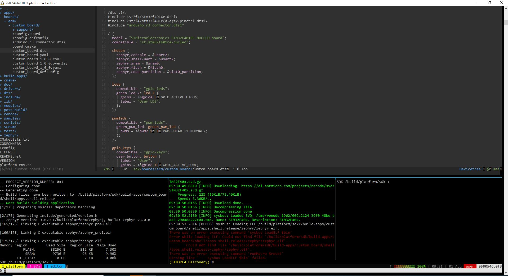

# Swedish Embedded Platform SDK Docker Image

This repository contains two docker images:

- **CI Build Image**: to be used for running CI pipeline. This image contains all toolschains and build tools (more than the original Zephyr image!)
- **Developer Image**: this image contains a standalong development environment based on Doom Emacs and tmux which can be used for development.

The fact that only terminal based tools are used makes these containers highly flexible and usable on any system with a terminal (even windows with WSL installed).


Windows setup (using Windows subsystem for linux (WSL)):



## Support

- Community: https://swedishembedded.com/community

## Developer Docker Image

### Overview

The developer image includes all tools included in the build image as well as
additional tools that are useful for development:

- **Emacs**: with doom config and extra plugins that make development easy.

- **Tmux**: with specialized theme so you can create multiple workspaces.
  Essentially making your terminal into a tiling window manager where you can
  run multiple terminal programs.

- **GDB Dashboard**: for easy graphical GDB debugging.

### Installation

#### Using Pre-built Developer Docker Image

Pull the latest prebuilt docker image:

```
docker pull swedishembedded/develop:latest
docker run -ti -v $myworkspace:/data \
           swedishembedded/develop:latest
```

The command above mounts your workspace under /data inside the image so you can
work on your local files from within the image.

In order to flash firmware over USB JTAG you also need to run docker in
privileged mode and mount usb within docker:

```
docker run -ti -v $myworkspace:/data \
	--privileged -v /dev/bus/usb:/dev/bus/usb \
    swedishembedded/develop:latest
```

This will allow you to access JTAG adapter from inside the container. You can
also expose other resources to the container in the same way.

Once inside the image, there is a workspace tool installed called tmuxinator which is bound to alias "workspace". You can open the demo workspace like this:

```
workspace demo
```

Check out the configuration like this:

```
cat ~/.bashrc
ls -la ~/.config/tmuxinator
```

#### Building the Images

Images can be built using the supplied shell script:


```
./build
```

### Usage

#### Building a sample application

Follow the steps below to build and run a sample application:

```
cd /build/platform
west build -b stm32f429i_disc1 -s ../zephyr/samples/basic/blinky -t flash
```

Note that /build/platform is a demo platform that should only be used to
quickly get started. You should mount a local directory from your filesystem
when you want to work on actual source code. This is better because then you
are not creating unnecessary docker data (docker wastes a lot of space when you
change files since it usually copies changes into "volumes" which quickly eat
up your disk space if you modify many files inside a container. Therefore it's
better to keep files you modify on your local system instead)

## Cleanup

If you find that your system runs out of space then you can always delete all modified docker data by pruning everything (be careful because this will delete any changes you have done to files inside a docker container. It will **not** however remove files you modified in a mounted local directory. So it's safe.):

```
docker system prune --volumes
```

## Questions

### Why is the docker image so big?

Because it includes **all essential tools** including a handful of different
compilers which are used for crosscompiling, source code and git repositories
used for demo. Every tool included in the base image is useful at some stage in
the build process. The build image is designed to be a versatile build image
that can be used to build not just firmware but multiple types of documentation
as well.

### Is it possible to reduce the size?

You can probably reduce the size but it is not practical because you will
always run into cases where you need extra tools and you will find that you
will need to add them back again. It is better to have a single image that
contains a complete and reproducible invironment so that it is possible to
easily scale development to multiple projects.

Besides, 15GB is not much considering that it is basically a full ubuntu setup
with everything included inside.

