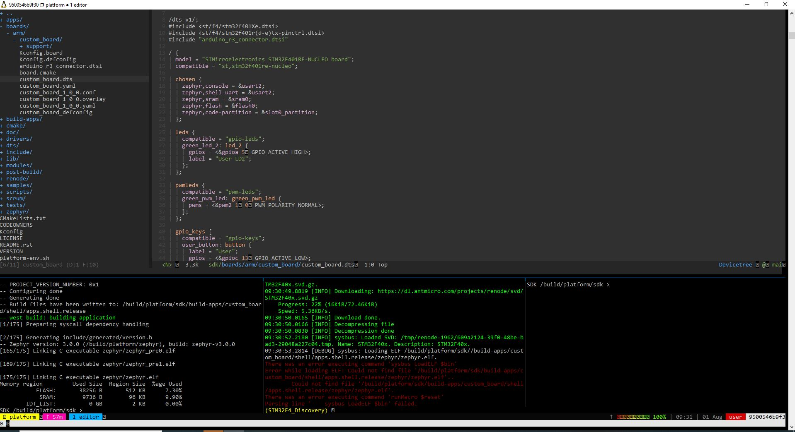

.. Swedish Embedded Workstation documentation, Martin Schröder

Swedish Embedded Workstation
============================

.. toctree::
   :maxdepth: 2
   :caption: Contents:

- Git repository: https://github.com/swedishembedded/workstation
- Community: https://swedishembedded.com/community

Introduction
============

This is a development docker image for building embedded systems using Zephyr RTOS and Swedish
Embedded Platform SDK.

.. figure:: images/demo.gif

    Demo of developer image]

    Windows WSL Development

It is separated into four different docker images that build on each other.

- **Developer Image**: this image contains a standalong development environment based on Doom Emacs
  and tmux which can be used for development.
- **Build Image**: to be used for running CI pipeline. This image contains all toolschains and
  build tools in addition to the Zephyr CI image.
- **Zephyr CI Image**: this image is imported here for reference. It is identical to Zephyr docker
  image provided by official Zephyr repository.
- **Zephyr Base Image**: this is the bare bones docker image for development also provided by
  Zephyr. It does not include anything beyond basic tools.

.. uml::

    @startditaa

    +-------------+
    |   develop   |
    +-------------+
           ^
           |
    +-------------+
    |    build    |
    +-------------+
           ^
           |
    +-------------+
    |     ci      |
    +-------------+
           ^
           |
    +-------------+
    |     base    |
    +-------------+

    @endditaa

Using Pre-built Image
=====================

Pull the latest prebuilt docker image:

.. code-block:: sh

    docker pull swedishembedded/develop:latest
    docker run -ti -v $myworkspace:/data \
           swedishembedded/develop:latest

The command above mounts your workspace under /data inside the image so you can
work on your local files from within the image.

In order to flash firmware over USB JTAG you also need to run docker in
privileged mode and mount usb within docker:

.. code-block:: sh

    docker run -ti -v $myworkspace:/data \
        --privileged -v /dev/bus/usb:/dev/bus/usb \
        swedishembedded/develop:latest

This will allow you to access JTAG adapter from inside the container. You can
also expose other resources to the container in the same way.

Once inside the image, there is a workspace tool installed called tmuxinator
which is bound to alias "workspace". You can open the demo workspace like this:

.. code-block:: sh

    workspace demo

Building Your Own Image
=======================

Images can be built using the supplied shell script:

.. code-block:: sh

    ./scripts/build

What is included
================

The following sections describe in more detail what is included into each image. This list may not
be fully up to date so please check the individual dockerfiles for up to date list of packages.

Base Image (Zephyr)
-------------------

This is the absolute minimum base image on which all other images are built. It starts with a Ubuntu
base image and installs the following tools:

.. list-table::
   :header-rows: 1
   :widths: 20 50

   * - Category
     - Packages
   * - General Dependencies
     - | software-properties-common
       | lsb-release
       | autoconf
       | automake
       | bison
       | build-essential
       | ca-certificates
       | ccache
       | chrpath
       | cpio
       | device-tree-compiler
       | dfu-util
       | diffstat
       | dos2unix
       | doxygen
       | file
       | flex
       | g++
       | gawk
       | gcc
       | gcovr
       | git
       | git-core
       | gnupg
       | gperf
       | gtk-sharp2
       | help2man
       | iproute2
       | lcov
       | libglib2.0-dev
       | libgtk2.0-0
       | liblocale-gettext-perl
       | libncurses5-dev
       | libpcap-dev
       | libpopt0
       | libsdl1.2-dev
       | libsdl2-dev
       | libssl-dev
       | libtool
       | libtool-bin
       | locales
       | make
       | net-tools
       | ninja-build
       | openssh-client
       | pkg-config
       | python3-dev
       | python3-pip
       | python3-ply
       | python3-setuptools
       | python-is-python3
       | qemu
       | rsync
       | socat
       | srecord
       | sudo
       | texinfo
       | unzip
       | valgrind
       | wget
       | ovmf
       | xz-utils
   * - Multi-lib gcc (x86 only)
     - gcc-multilib, g++-multilib
   * - i386 packages (x86 only)
     - libsdl2-dev:i386
   * - System Locale
     - en_US.UTF-8
   * - CMake
     - cmake
   * - Python Dependencies
     - | wheel
       | pip
       | west
       | sh
       | awscli
       | PyGithub
       | junitparser
       | pylint
       | statistics
       | numpy
       | imgtool
       | protobuf
       | GitPython

Base CI Image (Zephyr)
----------------------

This image comes from zephyr and includes the basic set of tools to run Zephyr based CI jobs.

It includes the following:

.. list-table::
   :header-rows: 1
   :widths: 20 50

   * - Category
     - Packages
   * - Doxygen (x86 only)
     - doxygen
   * - Renode (x86 only)
     - renode
   * - BSIM
     - BabbleSim
   * - uefi-run Utility
     - Rust, uefi-run
   * - LLVM and Clang
     - | llvm
       | clang
   * - Protobuf-compiler
     - protoc
   * - Zephyr SDK
     - zephyr-sdk

Build Image
-----------

This image extends Zephyr CI image and is intended as the main CI build image for applications using
Swedish Embedded Platform SDK. It includes the following packages:

.. list-table::
   :header-rows: 1
   :widths: 20 50

   * - Category
     - Packages
   * - Basic System Utilities
     - | bc
       | curl
   * - Python Packages
     - | cmakelang
       | click
       | black (22.3.0)
       | robotframework (4.0.1)
   * - Documentation Generation
     - | doxygen-latex
       | dot2tex
       | librsvg2-bin
       | texlive-latex-base
       | texlive-latex-extra
       | latexmk
       | texlive-fonts-recommended
       | ruby
       | bundler
       | aspell
       | aspell-en
       | asciidoctor-pdf (Ruby gem)
       | asciidoctor-html5s (Ruby gem)
   * - JavaScript and Node.js
     - nodejs, npm
   * - Ruby Packages for CMock
     - bundler, rake, manifest, require_all, constructor, diy
   * - Code Checking
     - | clang-format
       | libclang-12-dev
       | clang (12.0.1)
       | cscope
   * - Image Testing
     - imagemagick
   * - Other
     - git-lfs, octave
   * - PCB Design
     - Kicad, kibot (Python package)
   * - OSS CAD Suite
     - oss-cad-suite-linux-x64-20221105 (full suite for building Verilog stuff)

Developer Image
---------------

This image builds further on the "build" image and also includes the following packages:

.. list-table::
   :header-rows: 1
   :widths: 20 40

   * - Category
     - Packages
   * - Additional Development Tools
     - | cmake
       | ncurses-dev
       | libgccjit0
       | libgccjit-10-dev
       | libjansson4
       | libjansson-dev
       | gnutls-dev
   * - Text Editors
     - | emacs (version 28.1)
       | vim
       | nano
   * - Terminal Utilities
     - | tmux
       | tree
       | picocom
   * - Debugging Tools
     - gdb-multiarch
   * - Emacs Configuration
     - DooM emacs
   * - Tmux Configuration
     - tmuxinator
   * - Other
     - | ripgrep (search tool)
       | wget
       | renode-run
       | dos2unix

Cleanup
=======

If you find that your system runs out of space then you can always delete all
modified docker data by pruning everything (be careful because this will delete
any changes you have done to files inside a docker container. It will **not**
however remove files you modified in a mounted local directory. So it's safe.):

.. code-block:: sh

    docker system prune --volumes

Questions
=========

Why is the docker image so big?
-------------------------------

Because it includes **all essential tools** including a handful of different
compilers which are used for cross compiling, source code and git repositories
used for demo. Every tool included in the base image is useful at some stage in
the build process. The build image is designed to be a versatile build image
that can be used to build not just firmware but multiple types of documentation
as well.

Is it possible to reduce the size?
----------------------------------

You can probably reduce the size but it is not practical because you will always
run into cases where you need extra tools and you will find that you
will need to add them back again. It is better to have a single image that
contains a complete and reproducible invironment so that it is possible to
easily scale development to multiple projects.

Indices and tables
==================

* :ref:`genindex`
* :ref:`modindex`
* :ref:`search`
